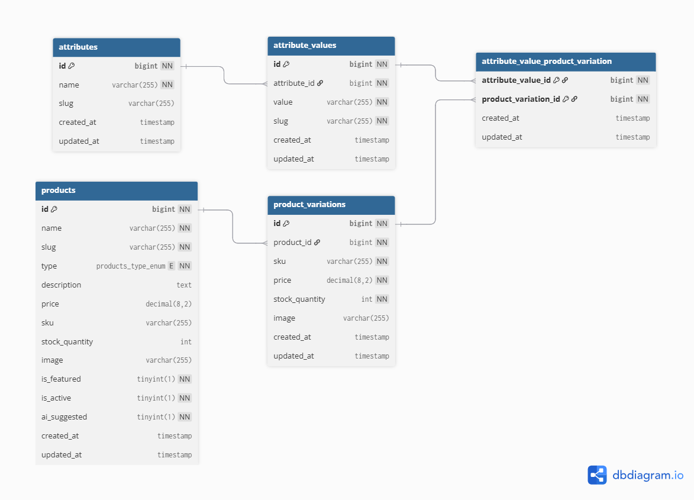

# Laravel Product Management API

This is a Laravel API-only application for managing a product catalog that supports both simple and variable products, built as a backend developer exam.

The API is designed to be scalable, well-structured, and follows best practices for building robust APIs with Laravel. It includes features like dynamic filtering, optimized querying, centralized error handling, and is fully documented using Scribe.

---

## Tech Stack & Features

- **Framework**: Laravel 11
- **Database**: MySQL
- **API Documentation**: [Scribe](https://scribe.knuckles.wtf/laravel) (Available at `/docs`)
- **Key Features**:
  - Simple & Variable Product Management
  - Advanced, chainable filtering (name, type, price range)
  - Optimized queries with Eager Loading to prevent N+1 issues
  - Centralized API response and error handling
  - Use of modern Laravel features: Enum Casting, Form Requests, API Resources
  - Service Layer for business logic encapsulation
  - Database seeding with realistic sample data

---

## Database Structure (ERD)

The database is designed to be normalized and scalable, effectively handling simple products and complex product variations with multiple attributes.




A brief explanation of the core tables:
- **`products`**: Stores core product information and data for simple products.
- **`attributes`**: Defines the types of variations available (e.g., Color, Size).
- **`attribute_values`**: Stores the specific options for each attribute (e.g., Red, Blue; Small, Large).
- **`product_variations`**: Represents a specific, sellable version of a variable product (e.g., "Red, Large T-Shirt"), with its own SKU, price, and stock.
- **`attribute_value_product_variation`**: A pivot table linking a `product_variation` to its defining `attribute_values`.


---

## Getting Started

### 1. Prerequisites
- PHP >= 8.2
- Composer
- MySQL
- A local web server environment (e.g., Laravel Herd, Valet, Laragon)

### 2. Installation & Setup

1.  **Clone the repository:**
    ```bash
    git clone https://github.com/anastalal/products_api.git
    cd products_api
    ```

2.  **Install dependencies:**
    ```bash
    composer install
    ```

3.  **Setup your environment file:**
    Copy the `.env.example` file to a new file named `.env`.
    ```bash
    cp .env.example .env
    ```
    Update the `DB_*` variables in the `.env` file with your local database credentials.

4.  **Generate application key:**
    ```bash
    php artisan key:generate
    ```

5.  **Run migrations and seed the database:**
    This command will set up the database schema and populate it with sample data.
    ```bash
    php artisan migrate:fresh --seed
    ```

6.  **Serve the application:**
    ```bash
    php artisan serve
    ```
    The API will be available at `http://127.0.0.1:8000`.

---

## How to Test Endpoints

The API is fully documented with interactive examples using **Scribe**. You can access the documentation by navigating to `/docs` in your browser:

[**http://127.0.0.1:8000/docs**](http://127.0.0.1:8000/docs)
 

You can also use the live version to test the api endpoints 
[**https://products.coderans.site/docs**](https://products.coderans.site/docs)

